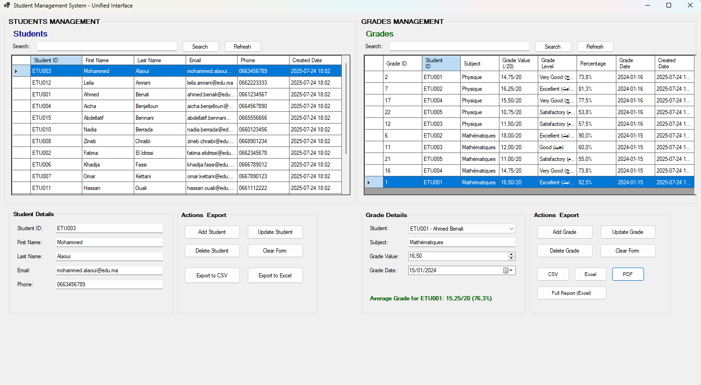

# Application de Gestion des Étudiants



> **Une application Windows Forms complète pour les établissements d'enseignement afin de gérer efficacement les dossiers étudiants et les notes. Développée avec .NET 8 et MySQL, avec une interface unifiée, le système de notation marocain (0-20), des analyses en temps réel et des capacités d'exportation complètes.**

---

## 🎯 Aperçu

Une application Windows Forms complète pour gérer les dossiers étudiants et les notes avec le système de notation marocain (0-20). Conçue pour les institutions éducatives avec une interface unifiée et des fonctionnalités d'exportation avancées.

## ✨ Fonctionnalités Principales

- **🎨 Interface Utilisateur Unifiée**
  - Gestion des étudiants et des notes côte à côte dans une seule fenêtre
  - Aucun onglet - les deux sections visibles simultanément
  - Grilles de données pour visualiser les enregistrements avec sélection de ligne complète
  - Panneaux de formulaires organisés pour la saisie et l'édition de données
  - Fonctionnalité de recherche dans les deux modules
  - Validation des données en temps réel
  - Fonctionnalité d'exportation avec plusieurs formats

- **👥 Gestion des Étudiants** (Panneau Gauche)
  - Ajouter, modifier, supprimer des étudiants
  - Rechercher des étudiants par nom, email ou ID
  - Validation d'email unique
  - Vérification d'existence de l'ID étudiant
  - Opérations CRUD complètes avec validation
  - Exporter les étudiants en CSV et Excel

- **📊 Gestion des Notes** (Panneau Droit)
  - Ajouter, modifier, supprimer des notes avec le système marocain (0-20 points)
  - Visualiser les notes par étudiant ou matière avec indicateurs de niveau
  - Calculer les moyennes par étudiant avec conversion en pourcentage
  - Suivi de l'historique des notes
  - Sélection d'étudiant via menu déroulant
  - Recherche avancée par matière
  - Exporter les notes en CSV, Excel et PDF
  - Génération de rapports complets avec plusieurs feuilles de calcul

- **📈 Capacités d'Exportation**
  - **Export CSV** : Données des étudiants et des notes
  - **Export Excel** : Étudiants, notes et rapports complets avec statistiques
  - **Export PDF** : Rapports de notes professionnels avec analyses
  - **Rapports Multi-feuilles** : Rapports Excel combinés avec analyses de synthèse

- **🗄️ Intégration Base de Données**
  - Connectivité base de données MySQL
  - Chaînes de connexion configurables
  - Test de connexion au démarrage
  - Gestion d'erreurs et validation
  - Support des transactions
  - Analyses avancées et rapports

## 🛠️ Stack Technologique

- **.NET 8** - Framework cible
- **Windows Forms** - Framework UI avec disposition SplitContainer
- **MySQL** - Base de données
- **MySql.Data** - Connecteur de base de données
- **EPPlus** - Fonctionnalité d'exportation Excel
- **iTextSharp** - Fonctionnalité d'exportation PDF
- **C# 12** - Langage de programmation

## 📋 Prérequis

- .NET 8 Runtime/SDK
- Serveur MySQL
- Visual Studio 2022 ou ultérieur (recommandé)

## 🚀 Instructions d'Installation

1. **Configuration de la Base de Données**
   - Installer MySQL Server
   - Exécuter le script `database_setup.sql` pour créer la base de données et les tables
   - Mettre à jour la chaîne de connexion dans `app.config` si nécessaire

2. **Configuration**
   - Mettre à jour la chaîne de connexion dans `app.config` :
   ```xml
   <connectionStrings>
       <add name="StudentManagementDB" 
            connectionString="Server=localhost;Database=student_management;Uid=root;Pwd=votre_mot_de_passe;" 
            providerName="MySql.Data.MySqlClient" />
   </connectionStrings>
   ```

3. **Compilation et Exécution**
   - Ouvrir la solution dans Visual Studio
   - Compiler la solution (Ctrl+Shift+B)
   - Exécuter l'application (F5)

## 🖥️ Disposition de l'Interface Utilisateur

L'application présente une **interface unifiée à fenêtre unique** avec :

### Panneau Gauche - Gestion des Étudiants
- **Grille de Données Étudiants** : Section supérieure montrant tous les étudiants
- **Détails Étudiant** : En bas à gauche avec formulaires de saisie
- **Actions Étudiant** : En bas à droite avec boutons CRUD et d'exportation

### Panneau Droit - Gestion des Notes
- **Grille de Données Notes** : Section supérieure montrant toutes les notes avec système marocain
- **Détails Note** : En bas à gauche avec formulaires de saisie et affichage de moyenne
- **Actions Note** : En bas à droite avec boutons CRUD et d'exportation

### Avantages de l'Interface
- **Vue côte à côte** : Voir étudiants et notes simultanément
- **Aucune navigation nécessaire** : Tout visible dans une fenêtre
- **Flux de travail logique** : Sélectionner étudiant à gauche, gérer notes à droite
- **Utilisation efficace de l'écran** : Maximise l'espace disponible

## 🇲🇦 Système de Notation Marocain

L'application utilise le système de notation authentique de l'éducation marocaine :

| Plage de Notes | Niveau | Arabe | Pourcentage |
|----------------|--------|-------|-------------|
| 16-20 | Excellent | امتياز | 80-100% |
| 14-15,99 | Très Bien | جيد جداً | 70-79,95% |
| 12-13,99 | Bien | جيد | 60-69,95% |
| 10-11,99 | Passable | مقبول | 50-59,95% |
| <10 | À Améliorer | ضعيف | <50% |

## 🎯 Fonctionnalités de l'Interface Utilisateur

### Section Étudiants (Panneau Gauche)
- **Grille de Données** : Affiche tous les étudiants avec tri et sélection
- **Panneau Détails Étudiant** :
  - ID Étudiant (requis, unique)
  - Prénom (requis)
  - Nom de famille (requis)
  - Email (requis, unique, validé)
  - Téléphone (optionnel)
- **Boutons d'Action** : Ajouter Étudiant, Modifier Étudiant, Supprimer Étudiant, Effacer Formulaire
- **Fonctionnalité de Recherche** : Recherche en temps réel dans tous les champs étudiants
- **Options d'Exportation** :
  - Export en CSV : Format de valeurs séparées par des virgules simple
  - Export en Excel : Feuille de calcul formatée avec style
- **Bouton Actualiser** : Recharger toutes les données étudiants

### Section Notes (Panneau Droit)
- **Grille de Données** : Affiche toutes les notes avec formatage du système marocain
- **Panneau Détails Note** :
  - Sélection Étudiant (menu déroulant avec étudiants existants)
  - Matière (requise)
  - Valeur Note (0-20, décimales supportées)
  - Date Note (sélecteur de date)
  - Affichage Moyenne Note (calcul dynamique avec pourcentage)
- **Boutons d'Action** : Ajouter Note, Modifier Note, Supprimer Note, Effacer Formulaire
- **Fonctionnalité de Recherche** : Recherche par nom de matière
- **Options d'Exportation** :
  - CSV : Export simple des données de notes avec niveaux
  - Excel : Rapport formaté avec statistiques et codage couleur
  - PDF : Rapport professionnel avec analyses du système marocain
  - Rapport Complet : Excel multi-feuilles avec étudiants, notes et analyses complètes
- **Bouton Actualiser** : Recharger toutes les données de notes

## 📄 Fonctionnalités d'Exportation

### Export CSV
- **Étudiants** : Informations étudiants de base au format CSV
- **Notes** : Données complètes des notes avec noms d'étudiants, niveaux de notes et pourcentages
- Format simple pour analyse de données et import dans d'autres systèmes

### Export Excel
- **Étudiants** : Formatage professionnel avec en-têtes colorés
- **Notes** : Rapports détaillés avec informations du système de notation marocain
- **Notes codées couleur** : Indicateurs visuels pour les niveaux de performance
- **Colonnes auto-ajustées** pour visualisation optimale
- **Statistiques de synthèse** incluant moyennes, distributions et analyses

### Export PDF
- **Rapports de notes professionnels** avec en-têtes et pieds de page
- **Formatage du système de notation marocain** et explications
- **Graphiques de distribution des notes** et analyses de performance
- **Section statistiques de synthèse** avec métriques clés
- **Horodatage de génération** pour traçabilité

### Export Rapport Complet
- **Classeur Excel multi-feuilles** avec :
  - Feuille étudiants avec données complètes des étudiants
  - Feuille notes avec informations détaillées des notes et niveaux
  - Feuille synthèse avec analyses complètes et distributions
- **Références croisées** entre étudiants et notes
- **Analyse statistique** et métriques de performance

## 📁 Structure du Projet

```
student-management-app/
├── Models/
│   ├── Student.cs          # Modèle d'entité étudiant
│   └── Grade.cs            # Modèle d'entité note avec système marocain
├── DataAccess/
│   ├── DatabaseConnection.cs  # Gestionnaire de connexion base de données
│   ├── StudentDAL.cs       # Couche d'accès aux données étudiants
│   └── GradeDAL.cs         # Couche d'accès aux données notes améliorée
├── Services/
│   └── ExportService.cs    # Service de fonctionnalité d'exportation
├── Form1.cs                # Code-behind du formulaire principal
├── Form1.Designer.cs       # Code designer de l'interface unifiée
├── Form1.resx              # Ressources du formulaire
├── Program.cs              # Point d'entrée de l'application
├── app.config              # Fichier de configuration
└── database_setup.sql      # Script de configuration BD avec données marocaines
```

## 🗃️ Schéma de Base de Données

### Table Étudiants
- `student_id` (VARCHAR(20), PRIMARY KEY)
- `first_name` (VARCHAR(50), NOT NULL)
- `last_name` (VARCHAR(50), NOT NULL)
- `email` (VARCHAR(100), NOT NULL, UNIQUE)
- `phone` (VARCHAR(20))
- `created_date` (DATETIME, DEFAULT CURRENT_TIMESTAMP)

### Table Notes (Système Marocain)
- `grade_id` (INT, AUTO_INCREMENT, PRIMARY KEY)
- `student_id` (VARCHAR(20), FOREIGN KEY)
- `subject` (VARCHAR(100), NOT NULL)
- `grade_value` (DECIMAL(4,2), NOT NULL, CHECK 0-20)
- `grade_date` (DATE, NOT NULL)
- `created_date` (DATETIME, DEFAULT CURRENT_TIMESTAMP)

## 🔄 Flux de Travail de l'Application

### Ajouter un Étudiant
1. Visualiser les étudiants dans la grille du panneau gauche
2. Remplir les détails de l'étudiant dans le formulaire en bas à gauche
3. Cliquer sur le bouton "Ajouter Étudiant"
4. Le système valide l'unicité de l'ID et de l'email
5. L'étudiant est ajouté à la base de données et la grille se rafraîchit

### Gérer les Notes
1. Visualiser les notes dans la grille du panneau droit
2. Sélectionner un étudiant dans le menu déroulant en bas à droite
3. Saisir la matière et la valeur de la note (0-20)
4. Définir la date de la note
5. Cliquer sur "Ajouter Note" pour sauvegarder
6. Visualiser le calcul automatique de la moyenne avec pourcentage

### Flux de Travail Unifié
1. **Sélectionner étudiant** dans la grille du panneau gauche
2. **Visualiser leurs notes** dans le panneau droit (vue filtrée)
3. **Ajouter nouvelles notes** en utilisant l'étudiant sélectionné
4. **Exporter données** en utilisant les boutons de format appropriés

### Exportation de Données
1. **Export Format Unique** : Cliquer sur le bouton d'export désiré (CSV, Excel, PDF)
2. **Choisir emplacement** : Sélectionner emplacement de sauvegarde et nom de fichier
3. **Génération automatique** : Le système crée un rapport formaté avec système marocain
4. **Confirmation** : Message de succès avec emplacement du fichier

### Recherche et Filtrage
- **Étudiants** : Recherche par nom, email ou ID étudiant dans le panneau gauche
- **Notes** : Filtrer par nom de matière avec correspondance partielle dans le panneau droit
- Effacer la recherche pour voir tous les enregistrements

## 🚀 Fonctionnalités Avancées

### Analyses de Notes
- **Calculs de moyennes** par étudiant (affichés en temps réel avec format marocain)
- **Classement des meilleurs étudiants**
- **Analyse par matière** et filtrage
- **Distribution des niveaux de notes** statistiques
- **Tendances de performance** et analyses

### Analyses d'Exportation
- **Statistiques automatiques** dans les exports Excel et PDF
- **Métriques de performance** incluant notes min, max, moyennes dans le système marocain
- **Distribution des notes** par niveaux de performance
- **Visualisations codées couleur** pour de meilleures insights
- **Rapports horodatés** pour traçabilité

### Intégrité des Données
- **Relations de clés étrangères** entre étudiants et notes
- **Opérations de suppression en cascade** (supprimer un étudiant supprime toutes les notes)
- **Validation** aux niveaux UI et base de données pour le système de notation marocain
- **Gestion d'erreurs** avec messages conviviaux

### Avantages de l'Interface
- **Aucun changement de contexte** : Les deux sections toujours visibles
- **Productivité améliorée** : Saisie et gestion de données plus rapides
- **Meilleur aperçu** : Voir les relations entre étudiants et notes
- **Disposition efficace** : Utilisation optimisée de l'espace écran

## ✅ Fonctionnalités de Validation

- **Validation des Champs Requis** : Empêche la soumission avec des données manquantes
- **Validation du Format Email** : Assure un format d'email valide en utilisant .NET MailAddress
- **Contraintes d'Unicité** : Empêche les doublons d'ID étudiants et d'emails
- **Validation Plage de Notes** : Assure que les notes sont entre 0-20 (système marocain)
- **Test de Connexion Base de Données** : Alerte l'utilisateur si la base de données n'est pas disponible
- **Validation d'Export** : Assure que les données existent avant les opérations d'export

## 🛡️ Gestion d'Erreurs

- Toutes les opérations de base de données incluent des blocs try-catch complets
- Messages d'erreur conviviaux avec détails spécifiques
- Notifications d'échec de connexion avec guidance
- Feedback de validation des données avec focus sur les champs
- Gestion d'erreurs d'export avec capacités de rollback
- Dégradation gracieuse en cas d'erreurs

## 📊 Données d'Exemple

L'application inclut des données d'exemple marocaines authentiques :
- **15 étudiants marocains** avec noms authentiques et adresses email .ma
- **Plusieurs matières** : Mathématiques, Physique, Chimie, Français, Arabe, etc.
- **Notes réalistes** à l'échelle 0-20 avec distribution appropriée
- **Analyses de notes** et suivi de performance

## ⚡ Optimisations de Performance

- **Index de base de données** sur les colonnes fréquemment interrogées
- **Pooling de connexions** géré par le connecteur MySql.Data
- **DataGridViews en lecture seule** pour performance améliorée
- **Requêtes efficaces** avec jointures et filtrage appropriés
- **Gestion mémoire** avec disposal approprié des ressources
- **Disposition SplitContainer** pour interface responsive

## 🤝 Contribution

1. Fork le repository
2. Créer une branche de fonctionnalité
3. Faire vos modifications
4. Tester minutieusement avec l'interface unifiée et fonctions d'export
5. Soumettre une pull request

## 🔧 Dépannage

### Problèmes Courants
1. **Erreur de Connexion Base de Données** : Vérifier le statut du serveur MySQL et la chaîne de connexion
2. **Erreurs de Compilation** : S'assurer que le .NET 8 SDK est installé
3. **Références Manquantes** : Restaurer les packages NuGet (EPPlus, iTextSharp)
4. **Problèmes d'Affichage du Formulaire** : Vérifier que le fichier Form1.resx existe
5. **Échecs d'Export** : Vérifier les permissions d'écriture vers le répertoire sélectionné

### Problèmes d'Interface
1. **Problèmes de disposition** : S'assurer que la taille minimale de fenêtre est maintenue (1500x800)
2. **SplitContainer non responsive** : Vérifier le dimensionnement et l'ancrage des panneaux
3. **Contrôles qui se chevauchent** : Vérifier le positionnement et dimensionnement des contrôles
4. **Problèmes de police** : S'assurer du scaling approprié des polices pour différents paramètres DPI

### Problèmes d'Export
1. **Fichiers Excel ne s'ouvrent pas** : S'assurer que le package EPPlus est correctement installé
2. **Génération PDF échoue** : Vérifier les dépendances iTextSharp
3. **Exports volumineux** : Pour de gros datasets, considérer l'implémentation d'indicateurs de progression
4. **Encodage de caractères** : Support UTF-8 pour le texte arabe dans les exports

### Conseils de Performance
- Utiliser la recherche et le filtrage pour travailler avec des datasets plus petits
- Maintenance régulière de la base de données pour performance optimale
- Redimensionner les panneaux en utilisant les séparateurs pour visualisation optimale
- Considérer l'archivage des anciennes données de notes périodiquement

## 🔒 Considérations de Sécurité

- **Prévention d'Injection SQL** : Toutes les requêtes utilisent des commandes paramétrées
- **Validation d'Entrée** : Validation complète sur toutes les entrées utilisateur
- **Sécurité des Chaînes de Connexion** : Stocker les données sensibles dans les fichiers de configuration
- **Accès aux Fichiers** : Les opérations d'export respectent les permissions de fichiers du système

## 🔮 Améliorations Futures

Domaines potentiels d'expansion :
- **Graphiques et Diagrammes** : Analyses visuelles pour les tendances de notes
- **Support Multi-langues** : Options d'interface Arabe/Français
- **Rapports Avancés** : Rapports par semestre et année académique
- **Photos d'Étudiants** : Gestion d'images de profil
- **Intégration Email** : Notifications de notes et rapports
- **Sauvegarde et Restauration** : Fonctionnalité de sauvegarde de base de données
- **Authentification Utilisateur** : Accès multi-utilisateurs avec rôles
- **Calendrier Académique** : Gestion des termes et semestres

## 📜 Licence

Ce projet est à des fins éducatives et démontre les meilleures pratiques pour les applications Windows Forms avec interfaces unifiées, intégration de base de données et capacités d'exportation complètes utilisant le système éducatif marocain.
